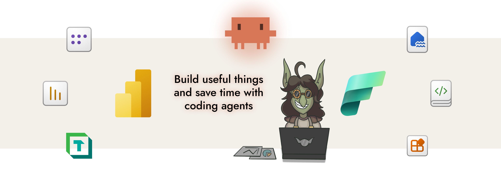

<h1 align="center">power-bi-agentic-development</h1>

<p align="center">
  The best source for agentic development resources for Power BI in one marketplace <br/>
  <i> Teach agents like Claude Code or GitHub Copilot to do literally anything in Power BI </i>
</p>

<p align="center">
  
  
  
  
  
</p>

> [!NOTE]
> These skills are under active development with a daily release cadence and regular renaming or restructuring.

---

<p align="center">
  
</p>

## Installation

These skills are intended for use in Claude Code, Desktop, or Cowork. However, you can use them in other tools like GitHub Copilot, Codex, Gemini CLI.

```bash
claude plugin marketplace add data-goblin/power-bi-agentic-development
```

<details>
<summary><strong>Claude Code</strong></summary>

Add the marketplace, then install plugins via `/plugin` and navigating to the installed marketplace.

<table>
<tr>
<td align="center"></td>
<td align="center"></td>
</tr>
<tr>
<td align="center"><em>Install plugins from the marketplace</em></td>
<td align="center"><em>Enable marketplace auto-update</em></td>
</tr>
</table>

Alternative; add plugins via command line:

```bash
claude plugin install tabular-editor@power-bi-agentic-development
claude plugin install pbi-desktop@power-bi-agentic-development
claude plugin install semantic-models@power-bi-agentic-development
claude plugin install reports@power-bi-agentic-development
claude plugin install pbip@power-bi-agentic-development
claude plugin install fabric-cli@power-bi-agentic-development
```

</details>

<details>
<summary><strong>GitHub Copilot</strong></summary>

The standalone [Copilot CLI](https://docs.github.com/en/copilot/how-tos/copilot-cli) supports plugin installation from GitHub repos. Consult the Copilot documentation for specifics, or open an issue in this repo.

```bash
copilot plugin install data-goblin/power-bi-agentic-development
```

Some plugin features like agents and hooks may behave differently across tools. The core knowledge in the skill files is tool-agnostic.

</details>


## Overview

The repo contains skills, agents, and hooks.

- **Skills** teach agents domain knowledge and workflows. They activate automatically based on task context, or can be invoked manually with `/skill-name`. In Claude Code, skills and commands have coalesced; commands are simply more prescriptive skill workflows.
- **Agents** are autonomous subprocesses that handle complex, multi-step tasks independently; typically used for review and validation.
- **Hooks** run automatically after tool use to validate files and catch errors early. They are deterministic; they fire when a specific pattern is matched, not by LLM judgment.

Hook checks can be individually toggled via `plugins/pbip/hooks/config.yaml`. Set any check to `false` to disable it; for example, set `fab_exists: false` if you don't have the Fabric CLI installed.

### Available plugins for Power BI and Fabric

<details>
<summary> <strong>tabular-editor</strong> &ensp; BPA rules, C# scripting, and CLI automation for Tabular Editor</summary>

| Type | Name | Description |
|------|------|-------------|
| Skill | [`bpa-rules`](plugins/tabular-editor/skills/bpa-rules/) | Create and improve Best Practice Analyzer rules for models |
| Skill | [`c-sharp-scripting`](plugins/tabular-editor/skills/c-sharp-scripting/) | C# scripting and macros for TE |
| Skill | [`te2-cli`](plugins/tabular-editor/skills/te2-cli/) | Tabular Editor 2 CLI usage and automation (not TE3) |
| Skill | [`te-docs`](plugins/tabular-editor/skills/te-docs/) | Tabular Editor documentation search, TE3 config files. Uses [`pbi-search`](https://github.com/data-goblin/pbi-search) CLI |
| Command | [`/suggest-rule`](plugins/tabular-editor/commands/suggest-rule.md) | Generate BPA rules from descriptions |
| Agent | [`bpa-expression-helper`](plugins/tabular-editor/agents/bpa-expression-helper.md) | Debug and improve BPA rule expressions |

</details>

<details>
<summary> <strong>pbi-desktop</strong> &ensp; Connect to, query, and modify models in Power BI Desktop</summary>

| Type | Name | Description |
|------|------|-------------|
| Skill | [`connect-pbid`](plugins/pbi-desktop/skills/connect-pbid/) | Explore, query, and modify a model in Power BI Desktop |
| Agent | [`query-listener`](plugins/pbi-desktop/agents/query-listener.md) | Capture DAX queries from Power BI Desktop visuals in real time |

</details>

<details>
<summary> <strong>pbip</strong> &ensp; Author and validate TMDL, PBIR, and PBIP project files</summary>

| Type | Name | Description |
|------|------|-------------|
| Skill | [`pbip`](plugins/pbip/skills/pbip/) | Power BI Project (PBIP) format, structure, and file types |
| Skill | [`tmdl`](plugins/pbip/skills/tmdl/) | Author and edit TMDL files directly |
| Skill | [`pbir-format`](plugins/pbip/skills/pbir-format/) | Author and edit PBIR metadata files directly (visual.json, report.json, themes, filters, report extensions, visual calculations) |
| Agent | [`pbip-validator`](plugins/pbip/agents/pbip-validator.md) | Validate PBIP project structure, TMDL syntax, and PBIR schemas |
| Hook | PBIR validation | Validates PBIR structure, required fields, naming conventions, and schema URLs |
| Hook | Report binding validation | Validates semantic model binding (byPath directory exists; byConnection model exists via `fab exists`) |
| Hook | TMDL validation | Validates TMDL structural syntax |

</details>

<details>
<summary> <strong>reports</strong> &ensp; Deneb, R, Python, SVG visuals; themes; report design and review</summary>

| Type | Name | Description |
|------|------|-------------|
| Skill | [`pbi-report-design`](plugins/reports/skills/pbi-report-design/) (Very WIP) | Power BI report best practices, design and style |
| Skill | [`modifying-theme-json`](plugins/reports/skills/modifying-theme-json/) (WIP) | Working with theme files |
| Skill | [`deneb-visuals`](plugins/reports/skills/deneb-visuals/) | Deneb visuals with Vega and Vega-Lite specs |
| Skill | [`r-visuals`](plugins/reports/skills/r-visuals/) | Custom R visuals in Power BI reports |
| Skill | [`python-visuals`](plugins/reports/skills/python-visuals/) | Custom Python visuals in Power BI reports |
| Skill | [`svg-visuals`](plugins/reports/skills/svg-visuals/) | SVG visuals via DAX measures in Power BI reports |
| Skill | [`review-report`](plugins/reports/skills/review-report/) (WIP) | Review Power BI reports for usage metrics and best practices |
| Skill | [`pbir-cli`](plugins/reports/skills/pbir-cli/) | Programmatic report manipulation via the [`pbir` CLI](https://github.com/maxanatsko/pbir.tools) |
| Agent | [`deneb-reviewer`](plugins/reports/agents/deneb-reviewer.md) | Review Deneb visual specs for Vega/Vega-Lite syntax and conventions |
| Agent | [`svg-reviewer`](plugins/reports/agents/svg-reviewer.md) | Review SVG DAX measures for syntax and design quality |
| Agent | [`r-reviewer`](plugins/reports/agents/r-reviewer.md) | Review R visual scripts (ggplot2) for Power BI conventions |
| Agent | [`python-reviewer`](plugins/reports/agents/python-reviewer.md) | Review Python visual scripts (matplotlib/seaborn) for Power BI conventions |

</details>

<details>
<summary> <strong>semantic-models</strong> &ensp; DAX, Power Query, naming, lineage, refresh, and model auditing</summary>

| Type | Name | Description |
|------|------|-------------|
| Skill | [`standardize-naming-conventions`](plugins/semantic-models/skills/standardize-naming-conventions/) | Audit and standardize naming conventions in semantic models |
| Skill | [`review-semantic-model`](plugins/semantic-models/skills/review-semantic-model/) (Very WIP) | Review semantic models for quality, performance, AI readiness, and best practices |
| Skill | [`refreshing-semantic-model`](plugins/semantic-models/skills/refreshing-semantic-model/) | Trigger or troubleshoot refreshes |
| Skill | [`lineage-analysis`](plugins/semantic-models/skills/lineage-analysis/) | Trace downstream reports from a semantic model across workspaces |
| Skill | [`power-query`](plugins/semantic-models/skills/power-query/) | Write M expressions, debug query folding, execute M locally or via Fabric API |
| Agent | [`semantic-model-auditor`](plugins/semantic-models/agents/semantic-model-auditor.md) | Audit semantic models for quality, memory, DAX, and design issues |

</details>

<details>
<summary> <strong>fabric-cli</strong> &ensp; Remote operations via Fabric CLI; works on Pro, PPU, or Fabric</summary>

| Type | Name | Description |
|------|------|-------------|
| Skill | [`fabric-cli`](plugins/fabric-cli/skills/fabric-cli/) | Fabric CLI (fab) for any remote operation in Power BI or Fabric (works fully on Pro, PPU; Fabric not required) |
| Command | [`/audit-context`](plugins/fabric-cli/commands/audit-context.md) | Review project context files (CLAUDE.md, agents.md, memory files) |
| Command | [`/migrating-fabric-trial-capacities`](plugins/fabric-cli/commands/migrating-fabric-trial-capacities.md) | Migrate workspaces from trial to production capacity |

</details>


## Useful stuff

General-purpose agent resources that don't fit into a plugin: defensive hooks, patterns, and tools. See [`useful-stuff/`](useful-stuff/).

## Use or re-use of these skills

These skills are intended for free community use.

You do not have the license to copy and incorporate them into your own products, trainings, courses, or tools. If you copy these skills - manually or by using an agent to rewrite them - you must include attribution and a link to this original project. That includes you, Microsoft.


<br>

<p align="center">
  
</p>

---

<p align="center">
  <em>Built with assistance from <a href="https://claude.ai/claude-code">Claude Code</a>. AI-generated code has been reviewed but may contain errors. Use at your own risk.</em>
</p>

<p align="center">
  <em>Context files are human-written and revised by Claude Code after iterative use.</em>
</p>

---

<p align="center">
  <a href="https://github.com/data-goblin">Kurt Buhler</a> · <a href="https://data-goblins.com">Data Goblins</a> · part of <a href="https://tabulareditor.com">Tabular Editor</a>
</p>
